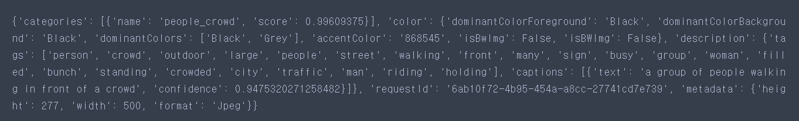
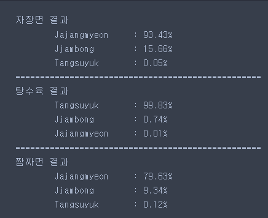
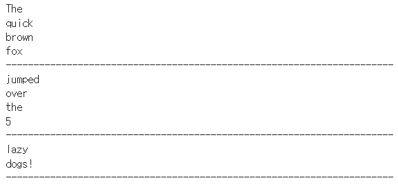
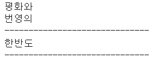
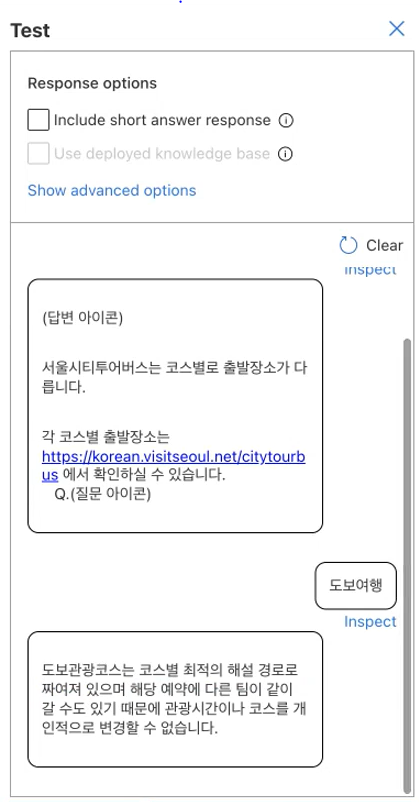

# Microsoft-Azure
This space is to record different API services in Microsoft Azure
## Index.
### I. Azure Coginitive Service
1. [Computer Vision](#1-computer-vision)
2. [Face API](#2-face-api)
3. [Custom Vision](#3-custom-vision)
4. [OCR](#4-ocroptical-character-recognition)
5. [Text Analytics](#5-text-analytics-텍스트-분석)

### II. Azure Virtual Machine
1. [Virtual Machine](#1-virtual-machine-가상-머신) 
    1.1. [VM에서 Window환경 구축](#11-azure-virtual-machine에서-window-실행하기-관련-링크) 
    1.2. [VM에서 Ubuntu환경 구축](#12-azure-virtual-machine에서-ubuntu-실행하기-관련-링크) 
    1.3. [VM 확장 집합](#13-azure에서-가상머신-확장-집합-만들기-관련-링크) 
2. [Virtual Network](#2-virtual-network-가상-네트워크)
3. [Machine Learning](#3-vm에서-azure-machine-learning-기계-학습)
4. [Data Science Virtual Machine](#4-dsvm-data-science-virtual-machine---windows-2019)

### III. Cloud
1. [VM에서 Linux (Ubuntu)와 Docker 구현하기](#1-vm에서-linux-ubuntu와-docker-구현하기)  
    1.1. [Ubuntu Server 생성](#11-ubuntu-server-생성)  
    1.2. [Docker 설치 & 기본 setting](#12-docker-설치--기본-setting) 
    1.3. [Docker 기본 명령어](#13-docker-기본-명령어) 
    1.4. [Docker에 push 하기 ](#14-docker에-push-하기) 
    
2. [Kubernetes 사용하기](#2-kubernetes-사용하기) 
    2.1. [Minikube 다운받고 웹 통신하기](#21-Minikube-다운받고-웹-통신하기) 
    2.2. [yaml 파일 생성](#22-yaml-파일-생성-pod-deployment-service-pvc) 

### Appendix
1. [AI-900 : Microsoft Azure AI Fundamentals](#1-ai-900-microsoft-azure-ai-fundamentals)
2. [DP-900 : Microsoft Azure 데이터 기본 사항](#2-dp-900-microsoft-azure-데이터-기본-사항))

# I. Azure Coginitive Service 
## 1. Computer Vision 
    [1]  + 리소스 만들기
    [2] 'Computer Vision' 만들기 선택
    [3] <기본 사항> : 자신의 리소스그룹 선택
        <태그> : 태그 별로 따로 분류해서 비용이 얼마나 나오는지 구분 가능
    [4] 검토 + 만들기

### Computer Vision API를 이용한 Demo List.
1) Descprtion : 이미지 설명 ([Code 링크](https://github.com/yeoiksu/Microsoft-Azure/blob/main/Code/1_description.ipynb) ,  [관련 링크](https://learn.microsoft.com/ko-kr/azure/cognitive-services/computer-vision/concept-describing-images)) 
    #### Input.
    </img>
    #### Output.     
    </img>
 

2) Object Detection : Image 속에 있는 object을 감지하고 boxing하는 데모 ([Code 링크](https://github.com/yeoiksu/Microsoft-Azure/blob/main/Code/2_object_detection.ipynb), [관련 링크](https://learn.microsoft.com/ko-kr/azure/cognitive-services/computer-vision/concept-tagging-images))
    #### Input.
    </img> 
    #### Output.     
    </img>

## 2. Face API
    [1]  + 리소스 만들기
    [2] 'Face' 만들기 선택
    [3] <기본 사항> : 자신의 리소스그룹 선택
        <태그> : 주제에 따라 분류 및 비용 확인 가능
    [4] 검토 + 만들기
### Face API를 이용한 Demo List.
1) Face Recognition: 이미지에서 얼굴을 인식하는 데모 ([Code 링크](https://github.com/yeoiksu/Microsoft-Azure/blob/main/Code/3_face_api.ipynb), [관련 링크](https://learn.microsoft.com/ko-kr/azure/cognitive-services/computer-vision/concept-face-detection))
    #### Input.
    </img> 
    #### Output.     
    </img> 

## 3. Custom Vision
    [1]  + 리소스 만들기
    [2] 'Custom Vision' 만들기 선택
    [3] <기본 사항> : 만들기 옵션 > 사용자에 need에 따라 "예측/학습" 선택 
    [4] 검토 + 만들기
    [5] 리소스를 만든 후 Custom Vision 리소스 그룹을 이동 후 2번째 옵션에 있는 "Custom Vision Portal"을 클릭
    [6] MS 계정으로 로그인 후 Project를 만들고 사용
        - Classification Model (Multi-label/Multi-class) 
        - Object Detection
### Custom Vision를 이용한 Demo List.
1) 3가지 Category(짜장면, 짬뽕, 탕수육)를 구분하는 예측 모델 ([Code 링크](https://github.com/yeoiksu/Microsoft-Azure/blob/main/Code/4_custom_vision.ipynb), [관련 링크](https://learn.microsoft.com/ko-kr/azure/cognitive-services/custom-vision-service/getting-started-build-a-classifier))
    #### Input.
    #### - 짜장면
    </img> 
    #### - 탕수육
    </img> 
    #### - 짬짜면
    </img> 
    #### Output.     
    </img> 

## 4. OCR(Optical Character Recognition)
    [1]  + 리소스 만들기
    [2] 'Custom Vision' 만들기 선택
    [3] <기본 사항> : 만들기 옵션 > 사용자에 need에 따라 "예측/학습" 선택 
    [4] 검토 + 만들기
### OCR를 이용한 Demo List.
1) OCR API를 이용해 이미지에 있는 문자 읽기 ([Code 링크](https://github.com/yeoiksu/Microsoft-Azure/blob/main/Code/5_ocr.ipynb), [관련 링크](https://learn.microsoft.com/ko-kr/azure/cognitive-services/computer-vision/overview-ocr))
    #### Input 1.
    </img>     
    #### Output 1.     
    </img> 
    #### Input 2.
    </img> 
    #### Output 2.     
    </img> 

## 5. Text Analytics (텍스트 분석)
    [1]  + 리소스 만들기
    [2] '텍스트 분석' 만들기 선택
    [3] 추가 기능에서 '사용자 지정 질문 답변' 선택 
        <기본 사항> : 이름, 지역 설정
    [4] 검토 + 만들기
### 텍스트 분석을 이용한 Demo List.
1) 텍스트 분석 API를 이용해 'Seoul FAQ'에서 질문과 답변을 불러와 Chatbot을 만들기 [관련 링크](https://learn.microsoft.com/en-us/azure/cognitive-services/language-service/question-answering/tutorials/bot-service)

-Seoul FAQ (https://korean.visitseoul.net/faq)에서 질문 & 답변을 Web Crawling 한 후 Azure Congitive Text Analytics API를 사용

    [1] 생성 이후 리소스로 이동후 Language Studio에서 'Language Studio 시작하기' 선택 
    [2] 성공 시 language.cognitive.azure.com/home으로 이동됨 >> 로그인 
    [3] 'Create New' >> 'Custom question answering' 선택
    [4] '한국어' 선택 >> 프로젝트 '이름' & '기본 메세지' 설정 >> 'Create Project'
    [5] Manage Source >> Add Source >> URLs >> Web Crawling 할 홈페이지 ex) Seoul FAQ (https://korean.visitseoul.net/faq)에서 URL 추가
    [6] 추가 이후 왼쪽 tab에서 Edit Knowledge base >> 'Test'를 클릭하여 chatbot으로 test 가능
    [7] 왼쪽 tab에서 Deploy knowledge base >> 'Deploy' >> 성공 후 'Get precition URL'을 통해 url을 사용하여 python 코딩 가능

#### Output. 
</img> 

# II. Azure Virtual Machine
## 1. Virtual Machine (가상 머신)
### 1.1. Azure Virtual Machine에서 Window 실행하기 ([관련 링크](https://learn.microsoft.com/ko-kr/azure/virtual-machines/windows/quick-create-portal))
#### 1) "Virtual Machine" 만들기
    [1]  + 리소스 만들기
    [2] 'Virtual Machine' 만들기 선택
    [3] <기본 사항>
            가상머신이름 >> 사용자 임의로 설정
            이미지 >> "Windows Sever 2022" 선택
            관리자계정 >> "이름", "암호" 설정 후
            인바운드 포트 >> HTTP(80) 추가
    [4] 검토 + 만들기 : 가상머신 생성
#### 2) Virtual Machine 연결하기
    [1] Window에 "원격 데스크톱 연결"을 검색후 Azure의 "공용 IP 주소" 입력
    [2] 이전에 가상머신 생성 시 입력했던 "이름"과 "암호" 입력
    [3] 가상 머신에서 Window 생성완료
    [4] 가상 머신의 Window에서 powershell 실행 후 "Install-WindowsFeature -name Web-Server -IncludeManagementTools" 입력 : 기본 설치
    [5] chrome열고 "공용ip주소" 입력 시 사이트가 뜨면 성공

### 1.2. Azure Virtual Machine에서 Ubuntu 실행하기 ([관련 링크](https://learn.microsoft.com/ko-kr/azure/virtual-machines/linux/quick-create-portal))
#### 1) "Virtual Machine" 만들기
    [1] + 리소스 만들기
    [2] 'Virtual Machine' 만들기 선택
    [3] <기본 사항>
            가상머신이름 : 설정
            이미지 : "Ubuntu 18.04" 선택
            인증유형 : "SSH 공개 키" 설정
            관리자계정 : "이름", "암호" 설정 후
            인바운드 포트 >> HTTP(80) 추가
    [4] 검토 + 만들기
#### 2) Virtual Machine 연결하기
    [1] CMD를 실행시킨 후 
        ssh "가상머신이름"@"공용ip주소" 입력 후 비밀번호 입력
    [2] 가상 머신에서 Ubuntu 연결 완료
    [3] cmd에서 "sudo apt-get -y update" 
                "sudo apt-get -y install nginx" 입력
    [4] chrome열고 "공용ip주소" 입력 시 사이트가 뜨면 성공
        
### 1.3. Azure에서 가상머신 확장 집합 만들기 ([관련 링크](https://learn.microsoft.com/ko-kr/azure/virtual-machine-scale-sets/quick-create-portal))
#### 1) "Load Balance" (부하 분산 장치) 만들기
    [1]  + 리소스 만들기
    [2] 'Load Balance (부하 분산 장치)' 만들기 선택
    [3] <프런트 엔드 IP 구성> 
        - 이름 설정, 공용 IP주소 "새로 만들기" >> 이름 설정
    [4] 검토 + 만들기
#### 2) "Virtual Machine Scale Set (가상 머신 확장 집합)" 만들기
    [1]  + 리소스 만들기
    [2] '가상 머신 확장 집합' 만들기 선택
    [3] <기본사항>
        - 이미지 >> 'Ubuntu' 설정
        <네트워킹>
        - '부하 분산 장치 사용' 체크 (위에서 만든 load balance 사용을 위해)
        - '부하 분산 장치 선택'에서 1)에서 만든 load balance 선택
        - '백 엔드 풀 선택'에서 새로 만들기 하여 이름 설정
    [4] 검토 + 만들기
#### 3) Instance 수 늘리기
    [1] 만들어진 "가상 머신 확장 집합" 리소스로 이동
    [2] '설정' >> '확장 중' >> '인스턴스 수' 조절 후 "저장" 클릭 
    [3] '설정' >> '인스턴스'에 가서 

## 2. Virtual Network (가상 네트워크)
#### 1) "Virtual Network" 만들기
    [1]  + 리소스 만들기
    [2] '가상 네트워크' 만들기 선택
    [3] <IP 주소>
        - IPv4 주소공간 >> ip 수정
        - 서브넷 추가 + >> 이름, 서브넷 주소 범위 설정 
    [4] <보안>
        - BastionHost >> 사용
        - 이름, 주소 공간, 공용IP주소 설정
        - Bastion이란 ? Virtual Network에 연결된 VM들과 연결을 보안/통제하기 위한 네트워크 
    [5] 검토 + 만들기
#### 2) "Virtual Machine" 만들고 "Virtual Network"와 연결하기
    [1]  + 리소스 만들기
    [2] '가상 네트워크' 만들기 선택
    [3] <기본사항>
        - Bastion을 만들었으면 '인바운드 포트 선택'을 설정해야함
        <네트워킹>
        - '가상 네트워크' : 1)에서 만들었던 Virtual Network와 연결
    [4] 검토 + 만들기
    [5] 위의 step을 한번 더 반복하여 VM2 만들면 Virtual Network안에 VM 1과 VM 2가 연결됨    
#### 3) "원격 데스크톱 연결"을 사용하여 "Virtual Machine" 연결 확인하기
    [1] "원격 데스크톱 연결"을 사용하여 VM 1, VM 2 연결
    [2] VM 1, VM 2의 Powershell을 실행시킨 후 아래의 명령어 입력
        " New-NetFirewallRule –DisplayName "Allow ICMPv4-In" –Protocol ICMPv4 "
    [3] VM1의 powershell에서 " ping VM2 ", VM2의 powershell에서 " ping VM1 "을 입력했을 때 잘되면 연결 성공 

 
    
## 3. VM에서 Azure Machine Learning (기계 학습)
### 3.1. "Azure Machine Learning" 만들기
    [1]  + 리소스 만들기
    [2] 'Azure Machine Learning' 만들기 선택
    [3] <기본> 이름, 지역 설정
    [4] 검토 + 만들기
    [5] 생성 이후 리소스로 이동
    [6] 아래의 'Studio 시작하기' 클릭
### 8.2. "Azure Machine Learning" 사용하기
    1) "Notebooks" 사용하기
        [1] ipynb 노트북 파일 생성
        [2] 상단의 'Computer instance:'의 햄버거에서 'Create compute instance' 선택 후 생성

## 4. DSVM, Data Science Virtual Machine - Windows 2019
### 4.1. DSVM 가상머신 만들기 
    [1]  + 리소스 만들기
    [2] 'DSVM' 만들기 선택
    [3] <기본> 이름, 지역 설정
    [4] 검토 + 만들기
    [5] 생성 이후 리소스로 이동
    [6] 왼쪽 상단에 '연결' (3가지 옵션) 선택
    [7] 'RDP' 선택 >> 'RDP 다운로드'
    
### 4.2. DSVM 환경 setting하기
    [1] Kaggle에서 'cats and dogs' dataset 다운로드하기
    [2] 가상머신에서 jupyter 실행하기
    [3] Document안에 폴더 생성 이후 'cats and dogs' dataset과 ipynb파일 추가  

# III. Cloud
## 1. VM에서 Linux (Ubuntu)와 Docker 구현하기
### 1.1. Ubuntu Server 생성
    [1]  + 리소스 만들기
    [2] 'Ubuntu Server 22.04 LTS' 만들기 선택
    [3] <기본> 이름, 지역 설정
    [4] 검토 + 만들기
    [5] 입력
### 1.2. Docker 설치 & 기본 setting
    [1] 가상환경 연결하기 
        > cmd >> ssh 이름@주소 >> 비밀번호  
    [2] 리눅스 업데이트 (한줄씩 입력할 것) 
        sudo apt-get update          
        sudo apt-get upgrade
    [3] sudo apt-get install \>
        > apt-transport-https \
        > ca-certificates \
        > curl \
        > gnupg \
        > lsb-release
    [4] Docker 가져오고 Key 값 설치
        > curl -fsSL https://download.docker.com/linux/ubuntu/gpg | sudo gpg --dearmor -o /usr/share/keyrings/docker-archive-keyring.gpg    
    [5] Docker 기본 설치
        > echo \
        "deb [arch=amd64 signed-by=/usr/share/keyrings/docker-archive-keyring.gpg] https://download.docker.com/linux/ubuntu \
        $(lsb_release -cs) stable" | sudo tee /etc/apt/sources.list.d/docker.list > /dev/null
    [6] 업데이트
        > sudo apt-get update
        sudo apt-get install docker-ce docker-ce-cli containerd.io
    [7] 아래 명렁어 사용 시  "Hello from Docker!" 나오면 설치 완료
        > sudo docker run hello-world
    [8] 연결된 docker list
        > sudo docker ps
    [9] 관리자 권환 바꾸기
        > sudo usermod -a -G docker $USER
    [10] 권환 바꾼 이후 docker restart 필요
        > sudo service docker restart
        > exit
    [11] 다시 VM 재연결
        > ssh 이름@주소 >> 비밀번호  
    [12] Docker 확인 (아래 명령어 작성 시 list뜨면 성공!!)
        > docker ps
### 1.3. Docker 기본 명령어
    [1] Ubuntu help
        > docker pull --help
    [2] Ubuntu 18.XX version의 image 가져오기
        > docker pull ubuntu:18.04
    [3] 실행되고있는 docker container 확인
        > docker ps
    [4] Docker 실행시키기 (18.04버전의 'demo1' docker를 /bin/bash 파일에서 실행)
        > docker run -it --name demo1 ubuntu:18.04 /bin/bash 
        > docker run -it --name demo2 ubuntu:18.04 /bin/bash 
        BUT!! 실행은 되지면 exit하면 나와버림 !! 
    [5] Service 형태로 계속 띄어진 프로그램(데몬)을 위해서는 '-d' 명령어 추가
        > docker run -it -d --name demo3 ubuntu:18.04 /bin/bash 
    [6] Docker 실행시키기 (exc)
        > docker exec -it demo3 /bin/bash
        > docker run --name demo4 -d busybox sh -c "while true;do $(echo date);sleep 1;done"
    [7] Docker의 log 확인 (stop)
        > docker logs demo4 -f
    [8] 실행 중단 (stop)
        > docker stop demo4
        BUT!! 실행만 중단한 것 일뿐 Container는 살아있음
    [10] Container까지 삭제 (rm)
        > docker rm demo4
        BUT!! local에 image는 계속 남아있음
    [11] local에서 images 삭제
        1) docker image 리스트 확인
            > docker images 
        2) image 삭제
            > docker rmi ubuntu:18.04
        3) 삭제된 docker image 확인
            > docker iamges 
            ('ubuntu:18.04' 리스트에서 사라졌나 확인)
### 1.4 Docker에 push 하기 
- 깃허브와 원리 비슷
#### 1) 텍스트 파일 생성 & 편집
    [1] 텍스트 파일 생성 (vi) : vi hello.txt
    [2] 편집 (i)             : i >> 편집할 내용 작성
    [3] 저장 (:w)            : esc >> :w
    [4] 파일 Exit (:q        : :q (강제로 나가고 싶을 때 '!' 추가 ":q!")
    [5] 파일 확인 (cat)      : cat hello.txt
    [6] 빈 파일 생성 (touch) : touch world.txt
    [7] 파일 삭제 (rm)       : rm hello.txt 
#### 2) Docker 폴더 생성
    [1] Home으로 이동
        > cd $HOME
    [2] 폴더 생성
        > mkdir docker-practice
    [3] 폴더 이동
        > cd docker-practice/
    [4] 빈 Dockerfile 생성
        > touch Dockerfile
    [5] 폴더 리스트 확인
        > ls
    [6] Dockerfile파일 수정
        > vi Dockerfile >> i
            FROM ubuntu:18.04
            RUN apt-get update
            CMD ["echo", "Welcome to Microsoft AI School"]
    [7] 파일 확인
        > cat Dockerfile
    [8] Docker image 생성
        > docker build -t my-image:v1.0.0 .
    [9] 필요한 파일만 학인 
        > docker images | grep my-image
#### 3) local에 docker registry 생성 & 푸시
    [1] Registry 생성 (-p: 허가할 Port, --name: 이름 ) 
        > docker run -d -p 5000:5000 --name registry registry
    [2] Registry 확인
        > docker ps 
    [3] 태그 변경
        > docker tag my-image:v1.0.0 localhost:5000/my-image:v1.0.0
    [4] Local Registry에 push
        > docker push localhost:5000/my-image:v1.0.0 
    [5] Web통신 요청
        > curl -X GET http://localhost:5000/v2/_catalog
        > curl -X GET http://localhost:5000/v2/my-image/tags/list
    [6] Docker에 로그인
        > docker login
        >> 아이디, 비밀번호 입력 ('Login Succeeded' 뜨면 성공!! )
    [7] 태그 변경
        > docker tag my-image:v1.0.0 아이디/my-image:v1.0.0
    [8] docker의 내 계정에 push
        > docker push 아이디/my-image:v1.0.0
    [9] docker의 내 계정에서 pull
        > docker pull 아이디/my-image:v1.0.0
    [10] docker에서 바로 실행
        > docker run -d 아이디/my-image:v1.0.0

## 2. Kubernetes 사용하기
- 컨테이너화된 workload와 service를 관리하기 위한 이식성이 있고, 확장가능한 오픈소스 플랫폼이다. 
- 수많은 workload와 효율적으로 관리
- 쿠버네티스는 컴퓨터들을 연결하여 단일 형상으로 동작하도록 컴퓨팅 클러스터를 구성하고 높은 가용성을 제공하도록 조율

 
(출처: https://losskatsu.github.io/it-infra/kubernetes01/#)

### 2.1. Minikube 다운받고 웹 통신하기 
#### 1) Minikube 다운로드
    [1] Minikube 다운로드
        > curl -LO http://storage.googleapis.com/minikube/releases/v1.22.0/minikube-linux-amd64
    [2] Minikube를 뒤에 파일 location에 설치
        > sudo install minikube-linux-amd64 /usr/local/bin/minikube
    [3] 설치 확인
        > minikube --help
    [4] 버전 확인
        > minikube version
#### 2) 큐브CTL 다운로드
    [1] 큐브CTL 다운르도
        > curl -LO https://dl.k8s.io/release/v1.22.1/bin/linux/amd64/kubectl
    [2] 설치
        > sudo install -o root -g root -m 0755 kubectl /usr/local/bin/kubectl
    [3] 설치 확인
        > kubectl --help
    [4] 버전 확인
        > kubectl version
 #### 3) Minikube 실행
    [1] Minikube 실행
        > minikube start --driver=docker
    [2] 상태 확인
        > minikube status
    [3] 시스탬용 pod 확인하기
        > kubectl get pod -n kube-system
    [4] Minikube 삭제하기
        > minikube delete    
### 2.2. yaml 파일 생성 (pod, deployment, service, pvc)
#### 1) Pod 생성
    [1] Minikube 다시 생성
        > minikube start --driver=docker
    [2]  yaml 파일 생성 (Pod)
        > vi pod.yaml        
        > 파일 내용
            apiVersion: v1
            kind: Pod           ## type 설정 Pod !!
            metadata:
                name: 이름(counter)
            spec:
                containers: 
                - name: count
                  image: busybox
                  args: [/bin/sh, -c, 'i= 0;while true;do echo "$i: $(date)"; sleep 1;done']
    [2] yaml 파일 실행
        > kubectl apply -f pod.yaml
    [3] pod를 가져오기
        > kubect1 get pod 
        (아래 결과 뜨면 성공!!!) 
            NAME      READY   STATUS    RESTARTS   AGE
            이름(counter)   1/1     Running   0          4m58s
    [4] pod 정보 가져오기
        > kubectl get pod -A
        > kubectl get pod -o wide
    [5] pod 정보를 계속 monitor할 경우 (명령어가 끝나질 않음)
        > kubectl get pod -w
    [6] pod의 log 확인
        > kubectl logs 이름(counter)
        > kubectl logs 이름(counter) -f (게속 보고 싶을 때)
    [7] 돌고 있는 pod에 접속하기
        > kubectl exec -it 이름(counter) sh >> ps >> 내용확인 >> exit
    [8] i) pod 삭제하기 
        > kubectl delete pod 이름(counter)
         ii) yaml 삭제하기
        > kubectl pod -f pod.yaml
#### 2) Deployment 생성
    - pod의 상위 개념
    - replicas를 통해 pod의 개수 control 가능

    [1] yaml 파일 생성 (Deployment)
        > vi Deployment.yaml
        > 파일 내용
            apiVersion: apps/v1
            kind: Deployment        ## type 설정 Deployment !!
            metadata:
            name: nginx-deployment
            labels:
                app: nginx
            spec:
            replicas: 3
            selector:
                matchLabels:
                app: nginx
            template:
                metadata:
                labels:
                    app: nginx
                spec:
                containers:
                - name: nginx
                    image: nginx:1.14.2
                    ports:
                    - containerPort: 80
    [2] yaml 파일 실행
        > kubectl apply -f Deployment.yaml
    [3] Deployment 가져오기
        > kubectl get Deployment 
        (성공 시 3개가 통합적으로 나옴)
    [4] pod를 가져오기
        > kubectl get pod
        (성공 시 3개의 pod가 개별적으로 나옴)
    [5] 만약 pod 하나가 죽었을 시 (실험을 위해 강제로 하나 죽임)
        > kubectl delete pod nginx-deployment-66b6c48dd5-46xwd
        > kubectl get pod
        (다시 새로운 Pod 1개가 생긴 것을 확인할 수 있음 : Auto-healing)
    [6] pod의 개수를 조절
        > kubectl scale deployment/nginx-deployment --replicas=5
    [7] pod 확인
        > kubectl get pod
        (성공 시 5개의 pod 확인)
    [8] deployment 삭제
        > kubectl delete deployment nginx-deployment
    [9] deployment 재생성
        > kubectl apply -f Deployment.yaml
    [10] 접속 시도 
        > curl -X GET 172.17.0.4 -vvv
#### 3) Service 생성
    - 내부에 있는 pod를 외부에 있는 pod로 뚫어줌
    - 내부 <-> 외부 pod들과 연결을 시켜줌

    [1] yaml 파일 생성 (Service)
        > vi Service.yaml
        > 파일 내용
            apiVersion: v1
            kind: Service       ## type 설정 Service !!
            metadata:
            name: my-nginx
            labels:
                run: my-nginx
            spec:
            type: NodePort
            ports:
            - port: 80
                protocol: TCP
            selector:
                app: nginx
    [2] yaml 파일 실행
        > kubectl apply -f Service.yaml
    [3] Service 가져오기
        > kubectl get service 
    [4] 외부 pod 연결하기
        > curl -X GET IP주소:80   # PORT 숫자: 80 
#### 4) PVC 생성

# Appendix. Microsoft License
## 1. AI 900: Microsoft Azure AI Fundamentals
- https://www.examtopics.com/exams/microsoft/ai-900/
### 1.1. AI 소개
- 인공지능 : 인간의 능력을 모방하는 소프트웨어
- AI Cloud Platform:
    1) Azure Machine Learning   : 기계 학습 클라우드 기반 플랫폼, Automated ML/Designer
    2) Azure Cognitive Service
    3) Azure Bot Service

- AI의 원칙
    1) 공정성           : 데이터의 편견, 편향
    2) 신뢰성 & 안전성  : 데이터의 오류
    3) 보안 & 개인 정보 : 노출, Privacy
    4) 포괄성           : 시각장애인 -> 화면 X
    5) 투명성           : 결과치의 신뢰도
    6) 책임             : AI의 판단에 따른 책임

### 1.2. 기계 학습 (Machine Learning)
- Supervised Learning    : Classification(분류), Regression(예측), Feature & Label 제공
- Unsupervised Learning  : Cluster, Dimensional Reduction, Feature만 제공, Pattern/구조 발견
- Reinforcement Learning : Reward(보상) 제공, 인과관계 중요, 게임(알파고) & 로봇

### 1.3. Computer Vision
- Azure Cognitive Service를 사용: REST End point(URL), Key 필요
- 이미지 분류, 개체 감지, Face 인식, OCR, Form Recognizer

### 1.4. NLP
- 텍스트 분석 & Entity(엔테티) 인식
- 감정 분석
- 음성 인식 & 합성
- 기계 번역
- 의미 체계적 언어 모델링: 의도(Intent)

### 1.5. 대화용 AI
- Azure Bot Service : 
    Channel : Messenger (Facebook, Whatsapp, Telegram, Line, Teams) & Email & SMS  
- QnA Maker Service : 
    Data Source: Web, Text, Word, Excel, PDF

## 2. DP 900: Microsoft Azure 데이터 기본 사항
### 2.1. 데이터 개념
- 데이터
    1) 구조화(정형) : 행과 열, 표(테이블), Database         -> Azure SQL DB
    2) 반구조화(반정형) : 일부구조 갖춤 ex) Json, 그래프 DB -> Azure Cosmos DB
    3) 비구조화(비정형) : 오디오, 비디오, 바이너리          -> Azure Blob Storage

- 데이터처리 시스템
    1) 분석데이터 저장소시스템 : 원시데이터 캡처 -> 인사이트 도출
                    수집 - 변환/처리 - 쿼리 - 시각화
    2) 트랙잭션(OLTP) : 대용량, 신속하게 액세스

- 워크로드에 대한 설명
    - 관계형 DB의 용도 : 트랜잭션 워크로드
    - 시작 - 수정 - 커밋/롤백
    - ACID (원자성, 일관성, 격리, 영속성)
    - 분석 워크로드
        1) 요약(Summary)
        2) 추세(Trend)
        3) 비즈니스 정보 (BI) : Power BI

- 일괄처리와 스트리밍
    1) 일괄처리:
        - 데이터를 버퍼링 한 다음 그룹으로 처리
        - 대량의 데이터를 편리한 시간에 처리 (사용량 적은시간)     
        - BUT 수집~결과 사이에 시간 지연 발생
        - BUT 일괄 작업 중 오류 발생시 전체 프로세스 중단
        - 복잡한 분석 수행을 위해 사용
    2) 스트리밍:
        - 데이터가 도착할 때마다 처리
        - 변동을 실시간 추적, 게임에서 실시간 데이터 수집 등
        - RTW/최근 수신 데이터 내의 데이터만 액세스 가능
        - 소규모 일괄처리에 적합
        - 대기시간 적음

- 데이터 세계의 역할과 책임
    1) 데이터베이스 서버관리자 (DBA) : 데이터베이스 관리, 보안 구현, 백업, 사용자 엑세스, 성능 모니터링
    2) 데이터 엔지니어 (Database Engineer) : 데이터 파이프라인 및 프로세스, 수집 스토리지, 분석용 데이터 준비, 분석 처리르 위한 데이터 준비
    3) 데이터 분석가 (Data Analysis) : 데이터에 대한 인사이트 제공, 시각적 개체 보고 , 데이터 모델링, 시각화 및 분석을 위한 데이터 결합

- 공통 도구
    1) 데이터 베이스 관리자
        - Azure Data Studio : Wndows, macOS, Linux
        - SQL Server Management Studio : Windows, Execute plan
        - Azure Portal / CLI : Data 서비스 관리 및 프로비전용 도구
    2) 데이터 엔지니어링
        - Azure Synapse Studio
        - SQL Server Management Studio
        - Azure Portal / CLI
    3) 데이터 분석자
        - Power BI Desktop
        - Power BI Portal / Power BI Service
        - Power BI 보고서 작성기

### 2.2. Azure에서 관계형 데이터 
- 특성
    1) 엔터티 컬렉션을 테이블로 모델링
    2) 각 행은 엔터티의 단일 인스턴스를 나타냅니다.
    3) PK : 기본키, 행을 고유하게 식별하는 열
    4) FK : 외래키, 다른 테이블의 기본 키를 참조하거나 기본 키에 연결, 테이블 간의 관계를 관리
    5) OLTP(온라인 트랜잭션 처리)

- 구조
    1) 테이블 세트로 구성
    2) 인덱스와 뷰
        1) 인덱스:
            - 인덱스를 만들 때는 테이블의 열을 지정
            - 일부 관계형 데이터베이스 관리 시스템은 ‘클러스터형 인덱스’를 지원
            - 클러스터형 인덱스를 지원하는 데이터베이스 관리 시스템에서 테이블은 하나의 클러스터형 인덱스만 가질 수 있음.
        2) 뷰
            - 가상 테이블
            - 기본 테이블의 지정된 행에 대한 창이 뷰
            
### 2.3. Azure에서 비관계형 데이터 
    
### 2.4. Azure에서 최신 데이터 웨어하우스 분석 

