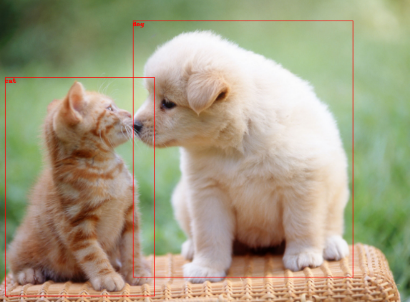

# Microsoft-Azure
This space is to record different API services in Microsoft Azure
## Index.
1. [Computer Vision](#1-computer-vision)
2. [Face API](#2-face-api)
3. [Custom Vision](#3-custom-vision)
4. [OCR](#4-ocroptical-character-recognition)
5. [Virtual Machine](#5-virtual-machine) 
    5.1. [VM에서 Window환경 구축](#51-azure-virtual-machine에서-window-실행하기-관련-링크) 
    5.2. [VM에서 Ubuntu환경 구축](#52-azure-virtual-machine에서-ubuntu-실행하기-관련-링크) 
    5.3. [VM 확장 집합](#53-azure에서-가상머신-확장-집합-만들기-관련-링크) 
6. [Virtual Network](#6-virtual-network-가상-네트워크)

<!-- 5. [여기]() -->

## 1. Computer Vision 
    [1]  + 리소스 만들기
    [2] 'Computer Vision' 만들기 선택
    [3] <기본 사항> : 자신의 리소스그룹 선택
        <태그> : 태그 별로 따로 분류해서 비용이 얼마나 나오는지 구분 가능
    [4] 검토 + 만들기

### Computer Vision API를 이용한 Demo List.
1) Descprtion : 이미지 설명 ([Code 링크](https://github.com/yeoiksu/Microsoft-Azure/blob/main/Code/1_description.ipynb) ,  [관련 링크](https://learn.microsoft.com/ko-kr/azure/cognitive-services/computer-vision/concept-describing-images)) 
    #### Input.
    </img>
    #### Output.     
    </img>
 

2) Object Detection : Image 속에 있는 object을 감지하고 boxing하는 데모 ([Code 링크](https://github.com/yeoiksu/Microsoft-Azure/blob/main/Code/2_object_detection.ipynb), [관련 링크](https://learn.microsoft.com/ko-kr/azure/cognitive-services/computer-vision/concept-tagging-images))
    #### Input.
    </img> 
    #### Output.     
    </img>

## 2. Face API
    [1]  + 리소스 만들기
    [2] 'Face' 만들기 선택
    [3] <기본 사항> : 자신의 리소스그룹 선택
        <태그> : 주제에 따라 분류 및 비용 확인 가능
    [4] 검토 + 만들기
### Face API를 이용한 Demo List.
1) Face Recognition: 이미지에서 얼굴을 인식하는 데모 ([Code 링크](https://github.com/yeoiksu/Microsoft-Azure/blob/main/Code/3_face_api.ipynb), [관련 링크](https://learn.microsoft.com/ko-kr/azure/cognitive-services/computer-vision/concept-face-detection))
    #### Input.
    </img> 
    #### Output.     
    </img> 

## 3. Custom Vision
    [1]  + 리소스 만들기
    [2] 'Custom Vision' 만들기 선택
    [3] <기본 사항> : 만들기 옵션 > 사용자에 need에 따라 "예측/학습" 선택 
    [4] 검토 + 만들기
    [5] 리소스를 만든 후 Custom Vision 리소스 그룹을 이동 후 2번째 옵션에 있는 "Custom Vision Portal"을 클릭
    [6] MS 계정으로 로그인 후 Project를 만들고 사용
        - Classification Model (Multi-label/Multi-class) 
        - Object Detection
### Custom Vision를 이용한 Demo List.
1) 3가지 Category(짜장면, 짬뽕, 탕수육)를 구분하는 예측 모델 ([Code 링크](https://github.com/yeoiksu/Microsoft-Azure/blob/main/Code/4_custom_vision.ipynb), [관련 링크](https://learn.microsoft.com/ko-kr/azure/cognitive-services/custom-vision-service/getting-started-build-a-classifier))
    #### Input.
    #### - 짜장면
    </img> 
    #### - 탕수육
    </img> 
    #### - 짬짜면
    </img> 
    #### Output.     
    </img> 

## 4. OCR(Optical Character Recognition)
    [1]  + 리소스 만들기
    [2] 'Custom Vision' 만들기 선택
    [3] <기본 사항> : 만들기 옵션 > 사용자에 need에 따라 "예측/학습" 선택 
    [4] 검토 + 만들기
### OCR를 이용한 Demo List.
1) OCR API를 이용해 이미지에 있는 문자 읽기 ([Code 링크](https://github.com/yeoiksu/Microsoft-Azure/blob/main/Code/5_ocr.ipynb), [관련 링크](https://learn.microsoft.com/ko-kr/azure/cognitive-services/computer-vision/overview-ocr))
    #### Input 1.
    </img>     
    #### Output 1.     
    </img> 
    #### Input 2.
    </img> 
    #### Output 2.     
    </img> 

## 5. Virtual Machine (가상 머신)
### 5.1. Azure Virtual Machine에서 Window 실행하기 ([관련 링크](https://learn.microsoft.com/ko-kr/azure/virtual-machines/windows/quick-create-portal))
#### 1) "Virtual Machine" 만들기
    [1]  + 리소스 만들기
    [2] 'Virtual Machine' 만들기 선택
    [3] <기본 사항>
            가상머신이름 >> 사용자 임의로 설정
            이미지 >> "Windows Sever 2022" 선택
            관리자계정 >> "이름", "암호" 설정 후
            인바운드 포트 >> HTTP(80) 추가
    [4] 검토 + 만들기 : 가상머신 생성
#### 2) Virtual Machine 연결하기
    [1] Window에 "원격 데스크톱 연결"을 검색후 Azure의 "공용 IP 주소" 입력
    [2] 이전에 가상머신 생성 시 입력했던 "이름"과 "암호" 입력
    [3] 가상 머신에서 Window 생성완료
    [4] 가상 머신의 Window에서 powershell 실행 후 "Install-WindowsFeature -name Web-Server -IncludeManagementTools" 입력 : 기본 설치
    [5] chrome열고 "공용ip주소" 입력 시 사이트가 뜨면 성공

### 5.2. Azure Virtual Machine에서 Ubuntu 실행하기 ([관련 링크](https://learn.microsoft.com/ko-kr/azure/virtual-machines/linux/quick-create-portal))
#### 1) "Virtual Machine" 만들기
    [1] + 리소스 만들기
    [2] 'Virtual Machine' 만들기 선택
    [3] <기본 사항>
            가상머신이름 : 설정
            이미지 : "Ubuntu 18.04" 선택
            인증유형 : "SSH 공개 키" 설정
            관리자계정 : "이름", "암호" 설정 후
            인바운드 포트 >> HTTP(80) 추가
    [4] 검토 + 만들기
#### 2) Virtual Machine 연결하기
    [1] CMD를 실행시킨 후 
        ssh "가상머신이름"@"공용ip주소" 입력 후 비밀번호 입력
    [2] 가상 머신에서 Ubuntu 연결 완료
    [3] cmd에서 "sudo apt-get -y update" 
                "sudo apt-get -y install nginx" 입력
    [4] chrome열고 "공용ip주소" 입력 시 사이트가 뜨면 성공
        
### 5.3. Azure에서 가상머신 확장 집합 만들기 ([관련 링크](https://learn.microsoft.com/ko-kr/azure/virtual-machine-scale-sets/quick-create-portal))
#### 1) "Load Balance" (부하 분산 장치) 만들기
    [1]  + 리소스 만들기
    [2] 'Load Balance (부하 분산 장치)' 만들기 선택
    [3] <프런트 엔드 IP 구성> 
        - 이름 설정, 공용 IP주소 "새로 만들기" >> 이름 설정
    [4] 검토 + 만들기
#### 2) "Virtual Machine Scale Set (가상 머신 확장 집합)" 만들기
    [1]  + 리소스 만들기
    [2] '가상 머신 확장 집합' 만들기 선택
    [3] <기본사항>
        - 이미지 >> 'Ubuntu' 설정
        <네트워킹>
        - '부하 분산 장치 사용' 체크 (위에서 만든 load balance 사용을 위해)
        - '부하 분산 장치 선택'에서 1)에서 만든 load balance 선택
        - '백 엔드 풀 선택'에서 새로 만들기 하여 이름 설정
    [4] 검토 + 만들기
#### 3) Instance 수 늘리기
    [1] 만들어진 "가상 머신 확장 집합" 리소스로 이동
    [2] '설정' >> '확장 중' >> '인스턴스 수' 조절 후 "저장" 클릭 
    [3] '설정' >> '인스턴스'에 가서 

## 6. Virtual Network (가상 네트워크)
#### 1) "Virtual Network" 만들기
    [1]  + 리소스 만들기
    [2] '가상 네트워크' 만들기 선택
    [3] <IP 주소>
        - IPv4 주소공간 >> ip 수정
        - 서브넷 추가 + >> 이름, 서브넷 주소 범위 설정 
    [4] <보안>
        - BastionHost >> 사용
        - 이름, 주소 공간, 공용IP주소 설정
        - Bastion이란 ? Virtual Network에 연결된 VM들과 연결을 보안/통제하기 위한 네트워크 
    [5] 검토 + 만들기
#### 2) "Virtual Machine" 만들고 "Virtual Network"와 연결하기
    [1]  + 리소스 만들기
    [2] '가상 네트워크' 만들기 선택
    [3] <기본사항>
        - Bastion을 만들었으면 '인바운드 포트 선택'을 설정해야함
        <네트워킹>
        - '가상 네트워크' : 1)에서 만들었던 Virtual Network와 연결
    [4] 검토 + 만들기
    [5] 위의 step을 한번 더 반복하여 VM2 만들면 Virtual Network안에 VM 1과 VM 2가 연결됨    
#### 3) "원격 데스크톱 연결"을 사용하여 "Virtual Machine" 연결 확인하기
    [1] "원격 데스크톱 연결"을 사용하여 VM 1, VM 2 연결
    [2] VM 1, VM 2의 Powershell을 실행시킨 후 아래의 명령어 입력
        " New-NetFirewallRule –DisplayName "Allow ICMPv4-In" –Protocol ICMPv4 "
    [3] VM1의 powershell에서 " ping VM2 ", VM2의 powershell에서 " ping VM1 "을 입력했을 때 잘되면 연결 성공  
    
